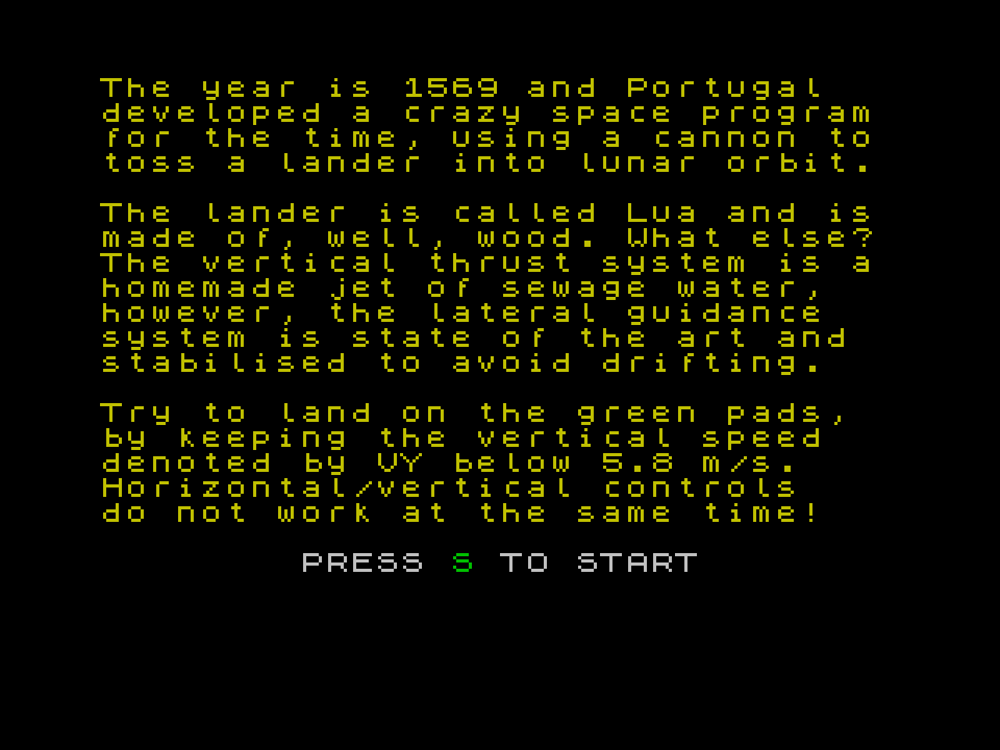

# Glulander

The year is 1569 and Portugal developed a crazy space program for the time, using a cannon to toss a lander into lunar orbit.

The lander is called Lua and is made of, well, wood. What else? The vertical thrust system is a homemade jet of sewage water, however, the lateral guidance system is state of the art and stabilised to avoid drifting.

Try to land on the green pads, by keeping the vertical speed denoted by VY below 5.8 m/s. Horizontal/vertical controls do not work at the same time!

## Screenshots





# Dependencies

* [The ZX BASIC Compiler](https://www.boriel.com/pages/the-zx-basic-compiler.html)

# Build

```
git clone https://github.com/vascocosta/glulander.git
cd glulander
./build
```